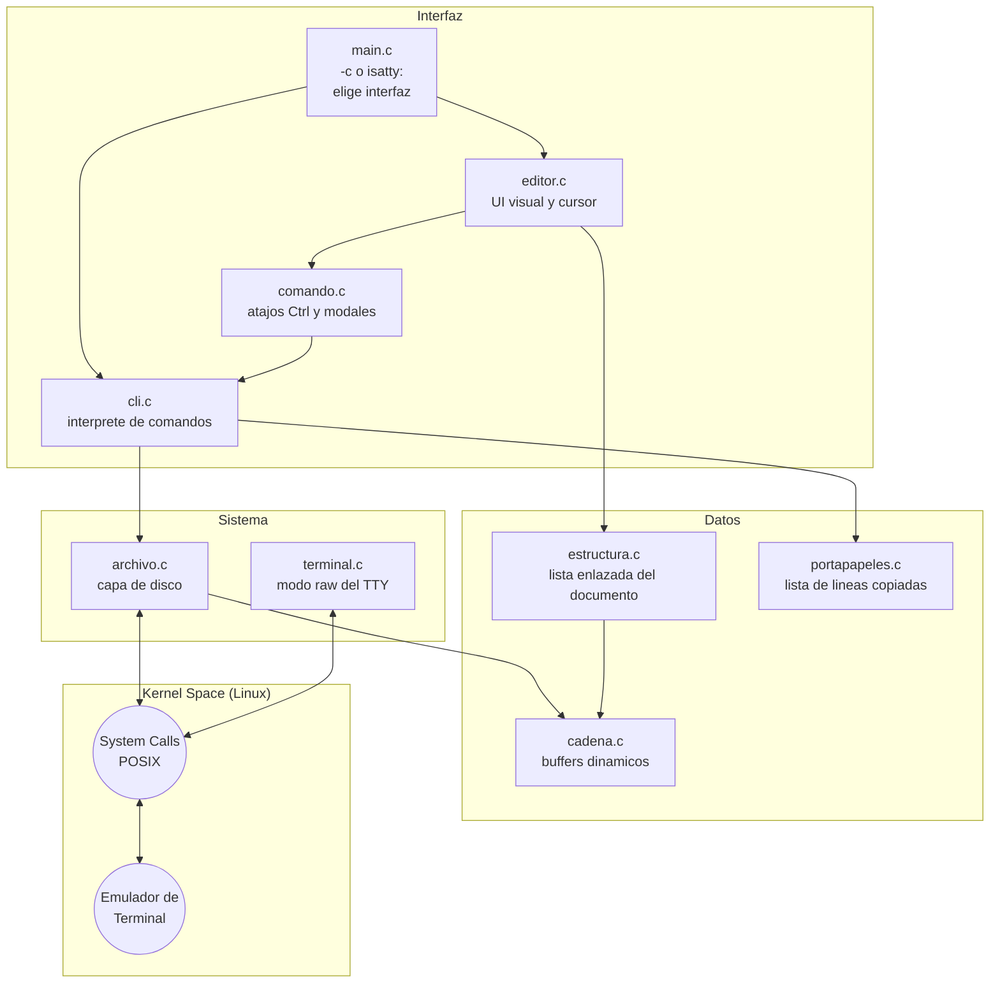
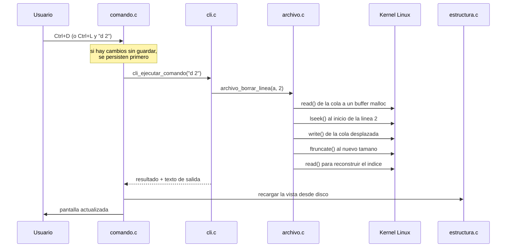
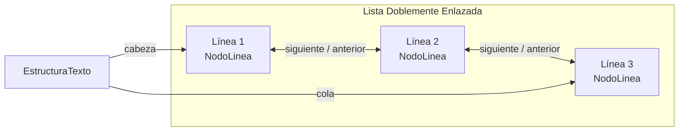

# Diseño Arquitectónico del Editor de Texto CLI

Este documento describe la arquitectura, las estructuras de datos y el uso de llamadas al sistema (System Calls) que sostienen el editor.

## 1. Arquitectura Modular

El proyecto se reparte en ocho módulos agrupados en tres capas.



* **`main.c`**: punto de entrada. La bandera `-c`/`--cli` fuerza el intérprete de línea; si no se pasa, consulta `isatty(STDIN_FILENO)` para decidir si arranca el editor visual (hay un teclado) o el intérprete por entrada estándar (hay una tubería).
* **`archivo.c` / `archivo.h`**: la capa de disco. Todas las llamadas al sistema que manipulan bytes del archivo viven aquí.
* **`cli.c` / `cli.h`**: el despachador de comandos, compartido por las dos interfaces.
* **`estructura.c` / `estructura.h`**: la lista doblemente enlazada que representa el documento en RAM.
* **`portapapeles.c`**, **`cadena.c`**: estructuras dinámicas auxiliares.
* **`editor.c` / `editor.h`**: interfaz visual, control del cursor y renderizado.
* **`comando.c` / `comando.h`**: atajos `Ctrl` y pantallas modales de diagnóstico.
* **`terminal.c` / `terminal.h`**: interacción a bajo nivel con el TTY.

---

## 2. Flujo de un comando

Éste es el recorrido completo de `d 2` escrito en la línea de comandos del modo visual:



La misma llamada a `cli_ejecutar_comando()` la hace `cli_repl()` cuando los comandos llegan por una tubería. Una sola implementación, dos formas de invocarla.

---

## 3. Estructuras de Datos

### 3.1 El documento en RAM: lista doblemente enlazada

Cada nodo representa una fila de texto, y cada fila contiene a su vez una lista de palabras. Así se define en `src/estructura.h`:

```c
// Una palabra (o un bloque de espacios) dentro de una linea.
typedef struct NodoPalabra {
    char *texto;
    size_t longitud;
    size_t capacidad;
    struct NodoPalabra *anterior;
    struct NodoPalabra *siguiente;
} NodoPalabra;

// Una linea del documento: nodo de la lista doblemente enlazada.
typedef struct NodoLinea {
    NodoPalabra *palabras_cabeza;
    NodoPalabra *palabras_cola;
    size_t longitud;              // caracteres totales de la linea
    struct NodoLinea *anterior;
    struct NodoLinea *siguiente;
} NodoLinea;

// El documento completo.
typedef struct {
    NodoLinea *cabeza;
    NodoLinea *cola;
    int totalLineas;
} EstructuraTexto;
```



### 3.2 El archivo en disco: índice de offsets

`archivo.c` no guarda el texto, guarda **dónde está**: dos arreglos dinámicos con el inicio y el largo de cada línea, reconstruidos tras cada mutación.

```c
off_t  *inicio;   // offset absoluto donde empieza cada linea
size_t *largo;    // largo de cada linea, sin contar el '\n'
```

Con eso, `p 7` es un `lseek` directo al byte de la línea 7 en vez de un recorrido desde el principio del archivo.

### 3.3 Buffers dinámicos: `longitud` vs `capacidad`

Tanto `NodoPalabra` como `Cadena` distinguen entre lo que ocupan y lo que tienen reservado. Si escribes 5 letras, `longitud` es 5, pero puede haber 32 bytes ya pedidos al sistema. Eso evita llamar a `realloc` en cada pulsación:

```c
int cadena_reservar(Cadena *c, size_t bytes_extra) {
    size_t necesaria = c->longitud + bytes_extra + 1;
    if (necesaria <= c->capacidad) return 0;      // ya cabe: no se pide nada

    size_t nueva = c->capacidad ? c->capacidad : 128;
    while (nueva < necesaria) nueva *= 2;         // duplicar hasta que alcance

    char *bloque = realloc(c->datos, nueva);
    if (!bloque) { perror("realloc"); return -1; }
    c->datos = bloque;
    c->capacidad = nueva;
    return 0;
}
```

Duplicar la capacidad hace que el coste de `n` inserciones sea O(n) amortizado, no O(n²).

---

## 4. Interacción con el Sistema Operativo (System Calls)

### A. Manipulación del archivo

Toda la edición ocurre sobre el descriptor abierto, sin `fopen` ni `fwrite`. Ejemplo real, el borrado de una línea:

```c
// 1. Guardar la cola posterior en un buffer dinamico
char *cola = leer_cola(a, fin_linea, &cola_largo);      // lseek + read

// 2. Reescribirla desplazada sobre la linea borrada
lseek(a->fd, inicio_linea, SEEK_SET);
escribir_todo(a->fd, cola, cola_largo);                 // write

// 3. Recortar los bytes que sobran al final
ftruncate(a->fd, a->tamano - (off_t)bytes_borrados);
```

El mapa completo de comando → llamada al sistema está en [SYSCALLS.md](SYSCALLS.md).

### B. Terminal en "Raw Mode" (Modo Crudo)

Un editor a pantalla completa no puede esperar a que el usuario pulse Enter. Manipulando la estructura `termios` se configuran banderas a bajo nivel:

```c
void terminal_activar_modo_raw() {
    if (tcgetattr(STDIN_FILENO, &termios_original) == -1) {
        perror("tcgetattr (la entrada estándar no es una terminal)");
        return;
    }
    atexit(terminal_desactivar_modo_raw);

    struct termios raw = termios_original;
    raw.c_lflag &= ~(ECHO | ICANON | IEXTEN | ISIG);  // apagar banderas
    raw.c_cc[VMIN] = 1;   // read() se bloquea hasta recibir 1 byte
    raw.c_cc[VTIME] = 0;  // sin limite de tiempo

    if (tcsetattr(STDIN_FILENO, TCSAFLUSH, &raw) == -1)
        perror("tcsetattr (activar modo raw)");
}
```

* `ECHO`: se apaga para que las letras no se impriman automáticamente.
* `ICANON`: se apaga para leer byte por byte.
* `ISIG`: se apaga para que `Ctrl+C` llegue al programa en vez de matarlo.

### C. Secuencias de Escape ANSI (VT100)

Para mover el cursor se envían códigos especiales por `write()`, que interpreta el emulador de terminal:

```c
void editor_refrescar_pantalla(EstadoEditor *e) {
    write(STDOUT_FILENO, "\x1b[2J", 4);   // borrar la pantalla
    write(STDOUT_FILENO, "\x1b[H", 3);    // cursor a la posicion 1,1

    editor_dibujar_filas(e);

    char buf[32];
    snprintf(buf, sizeof(buf), "\x1b[%d;%dH",
             (e->cursorY - e->desplazamientoFila) + 1, e->cursorX + 1);
    write(STDOUT_FILENO, buf, strlen(buf));
}
```

El sistema no distingue entre texto visible y órdenes de control: ambos viajan por la misma vía hacia `STDOUT_FILENO`.

---

## 5. Verificación de errores

Cada llamada al sistema comprueba su retorno y reporta con `perror()` añadiendo el contexto entre paréntesis. `read()` y `write()` pasan además por los envoltorios `leer_todo()` y `escribir_todo()`, que reintentan ante operaciones parciales o interrupciones por señal (`EINTR`): suponer que un `write()` de N bytes escribe siempre N bytes es un error clásico.
