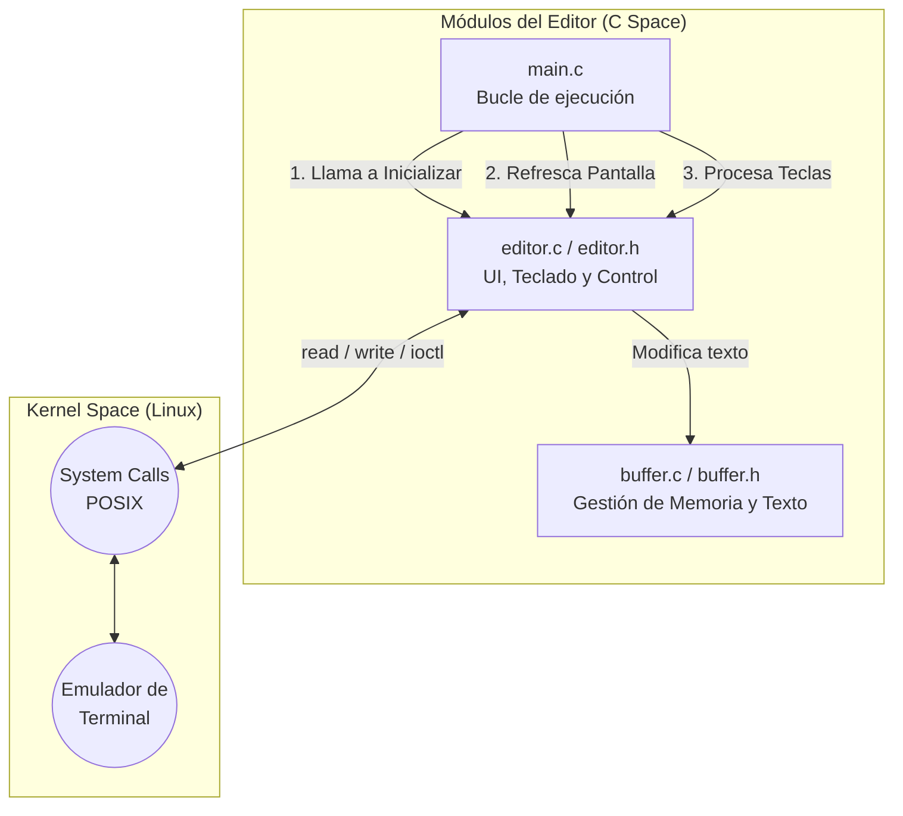
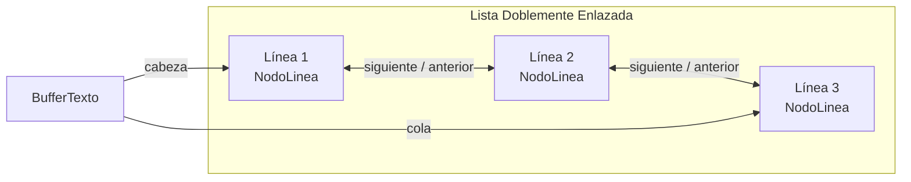
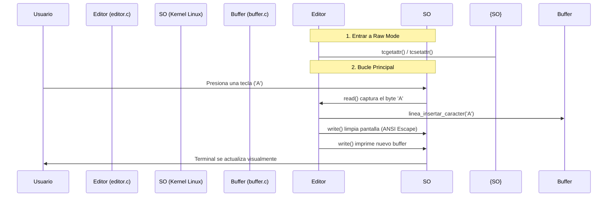

# Diseño Arquitectónico del Editor de Texto CLI

Este documento describe la arquitectura, la estructura de datos subyacente y el uso de llamadas al sistema (System Calls) para el funcionamiento del editor de texto modular en C.

## 1. Arquitectura Modular

El proyecto está dividido en tres módulos principales para garantizar la mantenibilidad y escalabilidad del código.



* **`main.c`**: Es el punto de entrada del programa. Maneja la inicialización del editor y mantiene el ciclo de vida principal (el "Game Loop"), que consiste en refrescar constantemente la pantalla y capturar las entradas del teclado de forma infinita hasta que el usuario decida salir.
* **`estructura.c` / `estructura.h`**: Contiene toda la lógica relacionada con el manejo de la memoria y la manipulación del texto. Aquí es donde se define y controla la estructura de datos.
* **`editor.c` / `editor.h`**: Contiene toda la lógica de interfaz de usuario, control del cursor, menús de ayuda, procesamiento de teclas especiales y la interacción directa con la terminal del sistema operativo a bajo nivel.

---

## 2. Estructura de Datos (El Buffer de Texto)

Para almacenar el texto, el editor utiliza una **Lista Doblemente Enlazada** de líneas.



### Anatomía de un `NodoLinea` (Nodo de Línea)

Cada nodo representa una única fila de texto en el editor y gestiona su propia memoria interna. Así es como se define en C:

```c
// Estructura para representar una línea de texto individual.
typedef struct NodoLinea {
    char *datos;             // Puntero a los caracteres reales en memoria
    size_t longitud;         // Cantidad actual de caracteres escritos
    size_t capacidad;        // Capacidad de memoria dinámica reservada
    struct NodoLinea *anterior;  // Puntero a la línea de arriba
    struct NodoLinea *siguiente;  // Puntero a la línea de abajo
} NodoLinea;

typedef struct {
    NodoLinea *cabeza;       // Referencia directa al inicio del texto
    NodoLinea *cola;         // Referencia directa al final del texto
    int totalLineas;         // Contador de número de líneas
} BufferTexto;
```

### ¿Por qué `longitud` vs `capacidad`?

Si escribes 5 letras, `longitud` es 5. Sin embargo, mediante la lógica dinámica, a ese nodo se le pre-asignan más bytes (ej: `capacidad` = 32). Esto evita tener que llamar a la lenta función del sistema operativo `malloc` cada vez que presionas una tecla:

```c
void linea_insertar_caracter(NodoLinea *linea, size_t pos, char c) {
    // Si la longitud supera la capacidad pre-asignada, duplicamos la capacidad
    if (linea->longitud + 1 >= linea->capacidad) {
        linea->capacidad *= 2;
        linea->datos = (char*)realloc(linea->datos, linea->capacidad); // Syscall para expandir memoria
    }

    // Movemos el resto de letras a la derecha con un solo comando de memoria
    memmove(&linea->datos[pos + 1], &linea->datos[pos], linea->longitud - pos + 1);
    linea->datos[pos] = c;
    linea->longitud++;
}
```

---

## 3. Interacción con el Sistema Operativo (System Calls)

Un editor en línea de comandos (CLI) no depende de funciones estándar como `printf` o `scanf`, ya que estas esperan a que el usuario presione "Enter". Para lograr reacción instantánea (como en un videojuego), usamos directamente **Llamadas al Sistema POSIX**.



### A. Terminal en "Raw Mode" (Modo Crudo)

Al manipular la estructura `termios` utilizando llamadas, se configuran banderas a bajo nivel:

* `ECHO`: Se apaga para que las letras no se impriman automáticamente.
* `ICANON`: Se apaga para leer byte por byte.

```c
void editor_activar_modo_raw() {
    tcgetattr(STDIN_FILENO, &termios_original); // Obtener estado actual del SO
  
    struct termios raw = termios_original;
    // Apagar banderas (bitwise NOT)
    raw.c_lflag &= ~(ECHO | ICANON | IEXTEN | ISIG); 
    raw.c_cc[VMIN] = 0;  // No bloquear esperando caracteres
    raw.c_cc[VTIME] = 1; // Timeout de 1/10 de segundo

    // Aplicar los cambios al sistema
    tcsetattr(STDIN_FILENO, TCSAFLUSH, &raw); 
}
```

### B. Uso Directo de System Calls (`read` y `write`)

El teclado no devuelve cadenas (Strings), devuelve eventos de bytes en el `STDIN_FILENO`. Así capturamos la tecla presionada:

```c
void editor_procesar_tecla(EstadoEditor *e) {
    char c = '\0';
    // Syscall para leer 1 byte. Falla o retorna -1 si no hubo pulsación en el timeout
    if (read(STDIN_FILENO, &c, 1) == -1) return;

    if (c == TECLA_CTRL('s')) { 
        // Lógica de guardado...
    } else if (c >= 32 && c <= 126) {
        // Enviar carácter directamente al sistema de buffers de C
        linea_insertar_caracter(e->lineaActual, e->cursorX, c);
        e->cursorX++;
    }
}
```

### C. Secuencias de Escape ANSI (VT100)

Para mover el cursor por la pantalla, el editor envía códigos especiales mediante el System Call `write()` que son procesados por el hardware/emulador gráfico de la terminal:

```c
void editor_refrescar_pantalla(EstadoEditor *e) {
    // Escape secuence: \x1b[2J -> Pide al sistema que borre la pantalla
    write(STDOUT_FILENO, "\x1b[2J", 4);
  
    // \x1b[H -> Mueve el cursor a las coordenadas X=1, Y=1
    write(STDOUT_FILENO, "\x1b[H", 3);

    editor_dibujar_filas(e); // Pintar todo nuestro buffer de texto
  
    // Mover el cursor dinámicamente según nuestra posición interna (cursorY, cursorX)
    char buf[32];
    snprintf(buf, sizeof(buf), "\x1b[%d;%dH", (e->cursorY - e->desplazamientoFila) + 1, e->cursorX + 1);
    write(STDOUT_FILENO, buf, strlen(buf)); // Inyectar orden directamente a pantalla
}
```

Como se aprecia en el código, el sistema no distingue entre texto visible u órdenes ocultas; ambos se envían mediante la misma vía directa de `STDOUT_FILENO`.
